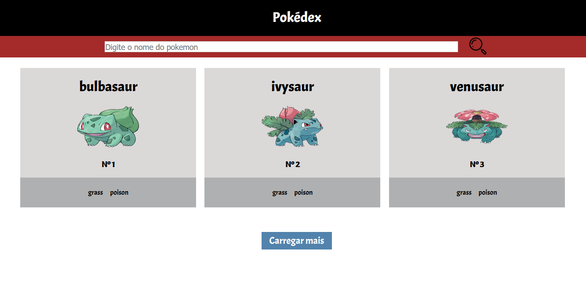

<h1>Pokédex</h1>

  Pokédex feita usando html,css e JavaScript puro 
  Usando a api: https://pokeapi.co/

## Getting Started

open the index.html file

## Build with

    <ul>
        <li><a href="https://developer.mozilla.org/pt-BR/docs/Aprender/JavaScript">JavaScript</a></li>
        <li><a href="https://developer.mozilla.org/pt-BR/docs/Web/HTML">Html</a></li>
        <li><a href="https://developer.mozilla.org/pt-BR/docs/Web/CSS">Css</a></li>
    </ul>

## Images
 
 
